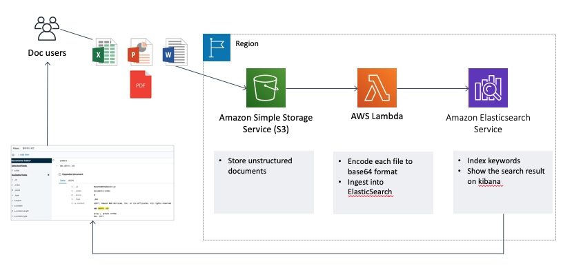
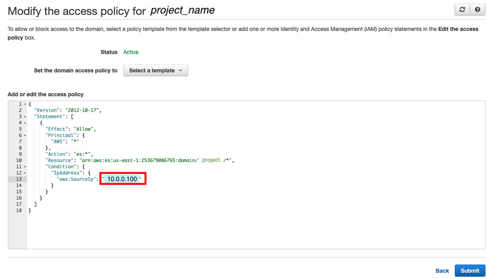
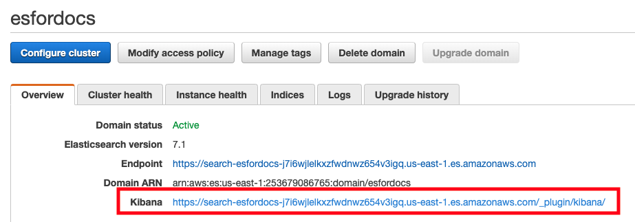
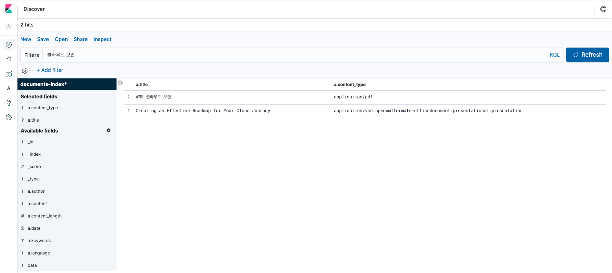

# How to Search and Index a Keyword in Unstructured Files Using ElasticSearch
Date: 2019. 09.16
Yongki, Kim (kyongki@)

## Background
IHAC who wants to search a keyword in unstructured files as like pdf, doc, excel even including image files(jpeg, png). He has stored a bunch of reference documents with various types and been struggled to find it when looked for specific topic. However I couldn't find right service in AWS services. So I digged into the ElasticSearch and found some useful way of ingesting and searching a keyword in ElasticSearch. Actually this way is not convenient and easy to do that, but at least this guide helps you to understand how to do it. In this article, I will show you how to upload a unstructured file on S3 and ingest it into ElasticSearch using lambda and search a keyword in Kibana.

## Processing Flow
  1. upload a pdf or pdf or doc file to S3
  2. make lambda encode file data and ingest into ElasticSearch
  3. create index pattern in ElasticSearch
  4. search a keyword in Kibana



## Keyword Search in various types of documents  with ElasticSearch
### AWS ElasticSearch Basic Configuration
Creating ElasticSearch domain on AWS is very easy, so I'll skip the detailed configuration and for more information about creating ElasticSearch Domain, follow the below guide. For the test(or lower charging), you need to select two options.
  - installation guide: https://docs.aws.amazon.com/elasticsearch-service/latest/developerguide/es-gsg.html

#### Data instances options for lower performance
  - Availability Zone: *1-AZ*
  - Instance Type: *t2.small.elasticsearch*
  - Number of Instances: 1


#### Access Policy
To prevent accessing from unauthorized area, set the *access policy*. In this way, only specified IP address can access to ElasticSearch.
  - identify your own IP address.
    * you can confirm it from this site(http://www.myipaddress.com/what-is-my-ip-address/)
  - Input your laptop's ip address into *access policy*
  

### S3 Bucket
Create S3 bucket to store documents
- bucket name: [yourname]-es-docs

``` shell
aws s3 mb s3://[yourname]-es-docs
```

### IAM Role for lambda
lambda should have a role with some policies about S3, CloudWatch, and ElasticSearch. Below using *role policy* json, you can permit it easily.
  - role name: lambda_elasticsearch_execution
  - role policy:
``` shell
{
    "Version": "2012-10-17",
    "Statement": [
        {
            "Action": [
                "logs:*"
            ],
            "Effect": "Allow",
            "Resource": "*"
        },
        {
            "Effect": "Allow",
            "Action": [
                "s3:Get*",
                "s3:List*"
            ],
            "Resource": "*"
        },
        {
            "Sid": "VisualEditor0",
            "Effect": "Allow",
            "Action": "es:ESHttp*",
            "Resource": "arn:aws:es:*:*:*"
        }
    ]
}
```
## Lambda Function
When a document file is uploaded in S3, lambda function will be triggered, and then it encodes a document data into base64, and ingests encoded data into ElasticSearch.
#### Steps to create ingestES lambda function
  1. create lambda code
  2. prepare function package
  3. create function "ingestES"
#### creating lambda code
- file name: ingestES.py

``` python
import boto3
import base64
import requests
import json
import urllib
from requests_aws4auth import AWS4Auth
import uuid

region = 'us-east-1' # e.g. us-west-1
service = 'es'
credentials = boto3.Session().get_credentials()
awsauth = AWS4Auth(credentials.access_key, credentials.secret_key, region, service, session_token=credentials.token)

host = 'https://search-[use_your_own_endpoint].us-east-1.es.amazonaws.com'    # the Amazon ES domain, including https://
index = 'documents-index'
doc_type = '_doc'
p_url = host + '/' + '_ingest/pipeline/attachment'
url = host + '/' + index + '/' + doc_type + '/' + '?pipeline=attachment'
i_url = host + '/' + index + '/' + '_settings'
i_data = { "index": {"highlight.max_analyzed_offset" : 100000000 }}
headers = { "Content-Type": "application/json" }
s3 = boto3.client('s3')

# function to prevent filename containg space from casuing NoSuchKey error
def encode_key(bucket, key_raw):
    key_utf8 = urllib.unquote_plus(key_raw.encode('utf-8'))
    key = key_utf8.decode('utf-8')
    print('bucket name: ' + bucket + ', file name: ' + key)
    return key

# function to convert s3 object to base64 encoding
def create_doc_data(bucket, key):
    obj = s3.get_object(Bucket=bucket, Key=key)
    obj_data = obj['Body'].read()
    encoded_data = base64.b64encode(obj_data)
    return encoded_data

# Lambda execution starts here
def handler(event, context):
    for record in event['Records']:
        # Get the bucket name and key for the new file
        bucket = record['s3']['bucket']['name']
        key_raw = record['s3']['object']['key']
        key = encode_key(bucket, key_raw)
        # Get file name and encode it into base64
        #obj = s3.get_object(Bucket=bucket, Key=key)
        #obj_data = obj['Body'].read()
        #encoded_data = base64.b64encode(obj_data)
        payload = { "data": create_doc_data(bucket, key) }
        # create attachment pipeline
        p_data = {"description": "Field for processing file attachment", "processors": [ { "attachment": { "field": "data"} } ] }
        p = requests.put(p_url, auth=awsauth, data=json.dumps(p_data), headers=headers)
        print("pipeline created: " + p.text)
        p.close()
        # ingest a file into ES
        r = requests.post(url, auth=awsauth, data=json.dumps(payload), headers=headers)
        print("ingestion status: " + r.text)
        r.close()
        # increase max_analyzed_offset
        # curl -XPUT $es_endpoint/pdf_doc/_settings -d '{ "index": {"highlight.max_analyzed_offset" : 100000000 }}' -H 'Content-Type: application/json'
        inc_para = requests.put(i_url, auth=awsauth, data=json.dumps(i_data), headers=headers)
        print("parameter status: " + inc_para.text)
        inc_para.close()
```
##### Detailed explanation about a code
- In order for ElasticSearch to index a document file, *ingest attachment* plugin should be necessary. Fortunately AWS ElasticSearch Service supports it already.
- Supported Plugins: https://docs.aws.amazon.com/elasticsearch-service/latest/developerguide/aes-supported-plugins.html

Elasticsearch Version  | Plugins
-------- | -----------------------
7.1      | * ICU Analysis
-         | * Ingest Attachment Processor
-         | * Ingest User Agent Processor
-         | * Seunjeon Korean Analysis
-         | * more ...

- Code `<p = requests.put(p_url, auth=awsauth, data=json.dumps(p_data), headers=headers)>` will create attachment pipeline.
- Actual ingestion occurs in this code,`<r = requests.post(url, auth=awsauth, data=json.dumps(payload), headers=headers)>`
- *host* variable: the endpoint of ElasticSearch
- *index* variable: Index name, kind of database in ElasticSearch
#### preparing a function package
- package name: ingestES.zip

```shell
1. Copy the sample code into a file named CreateThumbnail.py.

2. Create a virtual environment.
$ virtualenv ~/venv
$ source ~/venv/bin/activate

3. Install libraries in the virtual environment
$ pip install boto3 requests requests_aws4auth

4. Add the contents of lib and lib64 site-packages to your .zip file.
$ cd $VIRTUAL_ENV/lib/python2.7/site-packages
$ zip -r ~/ingestES.zip .

5. Add your python code to the .zip file
$ cd ~
$ zip -g ingestES.zip ingestES.py
```
#### creating lambda function
- function name: *ingestES*
- Runtime: *Python2.7*
- Execution role > Use a existing role > *lambda_elasticsearch_execution*
- press *Create function*
- "+ Add trigger"
  - Trigger Configuration
  - *S3*
  - Bucket Name: *[yourname]-es-docs*
  - Event type: *All object create events*
  - Check *Enable trigger*
- Function code
  - Handler: *ingestES.handler*
  - code entry type: *Upload a .zip file*
  - Upload: *select a prepared IngestES.zip*
- Basic settings
  - Memory(MB): *512MB*
- *Save*

#### lambda configuration example


### Document Upload to S3 and check the ElasticSearch
  1. upload sample.pdf to your bucket
``` shell
aws s3 cp sample.pdf s3://[yourname]-es-docs/
```
  2. watch cloudwatch logs to confirm whether lambda executes successfully
  3. check the ElasticSearch Index status

``` shell
curl -XGET https://[endpoint_of_elasticsearch]/documents-index/_stats
```

- *Index* of ElasticSearch is similar concept to database of mysql and every data store in Index.
- *Index* name is set by lambda code here as `<documents-index>`, you can change the name of index in above code if you want.

### ElasticSearch Configuration
The function of ElasticSearch is to store files or logs, and make schema and index. Kibana is responsible to presentation role, it means, if you want to search a keyword, you have to access Kibana console. AWS ElasticSearch provides it out of box, you can find it in AWS ElasticSearch domain information page when you create elasticsearch domain.


#### Creating Index Pattern in Kibana
  - access the kibana console
  - click *management* menu(gear icon, left side of screen)
  - click *Index Patterns*
  - click *Create index pattern*
  - input index pattern: "documents-index*"
  - click *Next step*
  - Time Filter field name: *I don't want to use the time filter*
  - confirm the index pattern "documents-index*" below "Create index pattern" box


#### Search a Keyword in Discover
  - access the kibana console
  - click *discover* menu(compass icon, left side of screen)
  - look at the one line data of the sample.pdf
  - add field (a.title, a.content_type)


## Verification
  - Upload another PPT document
  - check the cloudwatch logs to confirm whether lambda executed well or not
  - go to *Discover* menu of the kibana console
  - Search a keyword in Filters tab

## Next Step
  - Keyword Search in image files with Textract (https://aws.amazon.com/blogs/machine-learning/automatically-extract-text-and-structured-data-from-documents-with-amazon-textract/)
  - finding out good use case of ElasticSearch, like viewing top indexed keyword or catching meaningful insight

## Conclusion
Actually I'm not an expert of ElasticSearch or data handler, also there are already many solutions for document management in the market. However, as customer's requests, I wanted to make it in AWS services. There were many articles about "ingest attachment plugin" on internet, but I couldn't find out how to apply it on ElasticSearch. So I figured it out by my own way as I explained above, so there would be more efficient way to use elasticsearch comparing to me. If any of you knows better way, please let me know. Finally this is not sufficient for production. Be aware of it when you follow it.
