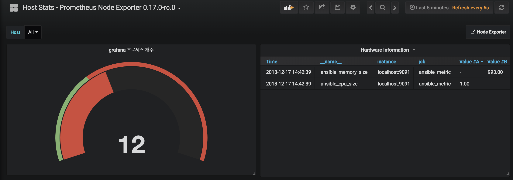
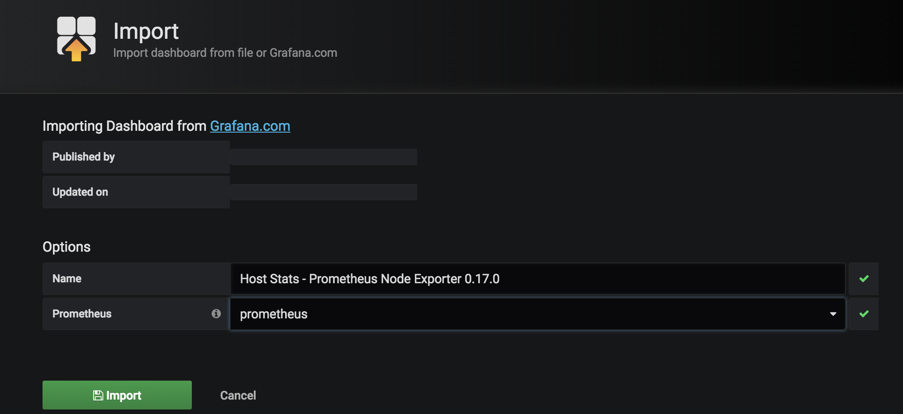
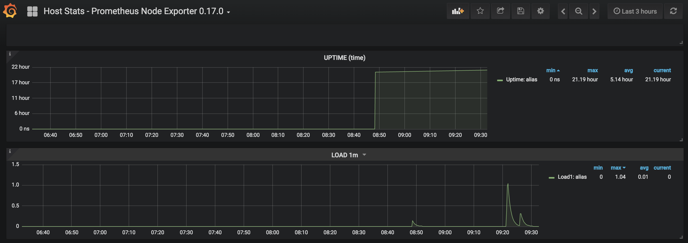
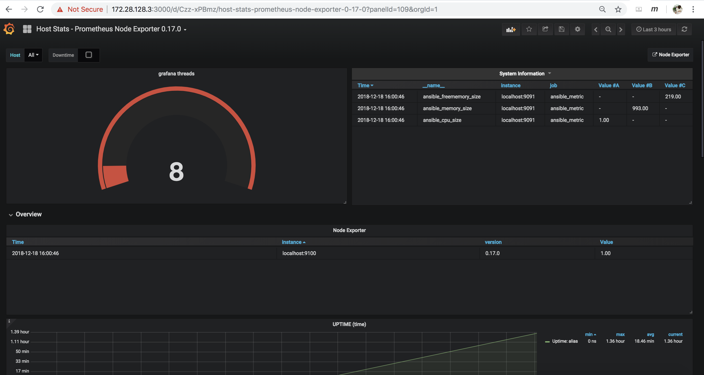

# Ansible Task Result with Prometheus and Grafana
ansible로 작업을 자동화하고 이에 대한 결과를 리포트로 만들어야 할 때가 있다. 또는 시스템의 정보를 ansible을 통해 가져오고 이를 대시보드로 보고자 할 때도 있다. 이런 작업은 ansible 또는 ansible-tower만 가지고는 지원하기 힘든 기능이기 때문에 grafana를 사용해서 표현할 수 있는 방법을 찾아보고자 이번 테스트를 진행하게 되었다. 또한 기존 데이터를 지속적으로 저장하고 기존과의 추이를 비교하기 위해서 prometheus도 같이 사용하였다. prometheus와 grafana는 최근 가장 많이 사용되는 모니터링 도구이기 때문에 ansible과의 연계도 이미 다른 사람이 진행했을 거라는 안일한 생각으로 시작했는데 막상 테스트하다보니 마땅한 자료를 찾기 힘들었다. 또한 위 두 솔루션에 대한 지식이 높이 않은 상태에서 진행하다보니 사소한 문제를 해결하는데도 많은 시간이 걸렸고, 아직도 해결 못한 문제가 몇가지 있는 상태이다. 

이번 테스트에서는 ansible의 facts 정보를 기반으로 시스템의 cpu와 메모리 정보를 불러오는 것과 grafana 쓰레드 사용개수를 변수로 저장하여 prometheus에 저장하고 이를 다시 grafana 로 표현하도록 하였다.

- 결과는 다음과 같다.


## Environment
- vagrant + virtualbox: VM을 생성하고 prometheus와 grafana를 설치
- ansible: 여러 시스템에 접속하여 Task를 수행하고 해당 결과를 pushgateway로 보냄
- prometheus: pushgateway로 부터 받은 데이터를 저장하고 grafana의 데이터소스로 활용
- node-exporter: 일종의 모니터링 agent로서 서버들에 설치되고, prometheus가 node-exporter 데몬에 접속하여 정보를 수집 
- pushgateway: prometheus는 기본이 pull 방식으로 자신이 직접 해당 데이터를 수집해감. 반대로 prometheus에 데이터를 밀어넣기(push) 하기 위해서는 pushgateway 설치가 반드시 필요.
- grafana: 오픈소스에서 가장 뜨거운 대시보드 솔루션

### Version
- node_exporter_version: 0.17.0
- prometheus_version: 2.5.0
- pushgateway_version: 0.7.0
- grafana: 5.1.3-1

## Installation
### VM on Vagrant
Vagrant 파일 내용은 아래와 같으며, ansible 플레이북 provision/prometheus.yml 으로 필요한 설정을 모두 구성토록 하였다. 
```ruby
Vagrant.configure("2") do |config|
  config.vm.box = "rhel7"
  config.vm.hostname = "prometheus"
  config.vm.network "private_network", ip: "172.28.128.3"
  config.vm.provision "ansible" do |ansible|
    ansible.playbook = "provision/prometheus.yml"
    ansible.inventory_path = "provision/inventory"
    ansible.limit = "all"
    ansible.verbose = "vv"
    ansible.become= "yes"
  end
end
```

### Prometheus, nodexporter, pushgateway, grafana Installation
prometheus.yml 플레이북은 다른 분이 작성한 내용을 일부 수정하여 사용하였고 원본에 아래 참고 페이지에 링크로 제공한다.
[playbook](vagrant/provision/prometheus.yml)
#### 해당 플레이북에서 볼 만한 내용은 다음과 같다.
- node-exporter와 pushgateway를 systemd job으로 등록하는 법
- unarchive 모듈이 작동하지 않아, shell 모듈로 압축파일을 풀었음
- 모든 패키지들은 /home/prometheus 하위 디렉토리에 설치(prometheus 설정파일인 prometheus.yml(플레이북 파일이름과 동일하나 전혀 다른 설정 파일) 파일은 /home/prometheus/prometheus-2.5.0.linux-amd64/ 에 위치)

## Configuration
### Data Flow
ansible task -> pushgateway -> prometheus -> grafana


* 이미지 하단의 kubernetes는 관계없으므로 무시해도 됨.

설정 순서는 다음과 같다.
- grafana 접속 및 정상여부 확인
- node-exporter 설정을 위한 json 다운로드 및 설정 적용
- pushgateway로 데이터를 보내기 위한(push) ansible playbook 작성 및 실행
- prometheus에서 해당 metric을 정상적으로 수집했는지 확인
- grafana의 대시보드에서 ansible로 수집한 데이터 표현 

### Confirming Services
systemctl 명령으로 필요한 각 서비스들이 정상적으로 가동되었는지 확인

```shell
[root@prometheus ansible]# for i in  grafana-server prometheus node_exporter pushgateway ;do systemctl status $i;done

● grafana-server.service - Grafana instance
   Loaded: loaded (/usr/lib/systemd/system/grafana-server.service; enabled; vendor preset: disabled)
      Active: active (running) since Fri 2018-12-14 00:45:30 UTC; 3 days ago
	       Docs: http://docs.grafana.org
		    Main PID: 10249 (grafana-server)
			   CGroup: /system.slice/grafana-server.service
			              └─10249 /usr/sbin/grafana-server --config=/etc/grafana/grafana.ini --pidfile=/var/run/grafana/grafana-server.pid cfg:default.paths.logs=/var/log/grafana cfg:default...


● prometheus.service - Prometheus
   Loaded: loaded (/etc/systemd/system/prometheus.service; enabled; vendor preset: disabled)
      Active: active (running) since Sun 2018-12-16 03:48:37 UTC; 1 day 20h ago
	   Main PID: 16753 (prometheus)
	      CGroup: /system.slice/prometheus.service
		             └─16753 /home/prometheus/prometheus-2.5.0.linux-amd64/prometheus --config.file=/home/prometheus/prometheus-2.5.0.linux-amd64/prometheus.yml --storage.tsdb.path=/hom...
					 
● node_exporter.service - Node exporter
   Loaded: loaded (/etc/systemd/system/node_exporter.service; enabled; vendor preset: disabled)
      Active: active (running) since Fri 2018-12-14 05:23:59 UTC; 3 days ago
	   Main PID: 12405 (node_exporter)
	      CGroup: /system.slice/node_exporter.service
		             └─12405 /home/prometheus/node_exporter-0.17.0.linux-amd64/node_exporter --collector.textfile.directory=/var/lib/node_exporter/metrics

● pushgateway.service - Push Gateway
   Loaded: loaded (/etc/systemd/system/pushgateway.service; enabled; vendor preset: disabled)
      Active: active (running) since Fri 2018-12-14 04:24:30 UTC; 3 days ago
	   Main PID: 11680 (pushgateway)
	      CGroup: /system.slice/pushgateway.service
		             └─11680 /home/prometheus/pushgateway-0.7.0.linux-amd64/pushgatew
```

### Grafana basic configuration
#### web console access
웹브라우저를 통해 아래 grafana 대시보드를 접속
- web access: http://172.28.128.3:3000
- default id/pw: admin/admin

#### adding prometheus datasource
데이터를 수집할 prometheus를 데이터소스로 추가
1. grafana 웹화면(http://172.28.128.3:3000)의 왼쪽 메뉴에서 톱니바퀴 모양 클릭
2. *Data Sources* 선택
3. 내용을 입력하는 화면에서 *Name* 입력하고, *Type*에 *Prometheus* 선택, *URL* 부분에 "http://localhost:9090" 입력 후 *Save & Test* 확인

### node-exporter configuration
node-exporter는 각 모니터링 대상 서버에 설치되어 필요한 정보를 수집해오는 agent 역할을 한다. cpu, memory, disk 등 서버의 기본적인 모니터링 상태부터 네트워크 사용량, cpu interrupt 등 다양한 정보를 수집해오기 때문에 prometheus + grafana 연동시에는 거의 사용되고 있다. 이번 테스트에서도 기본 대시보드는 node-exporter를 가지고 만든 *Host Stats* 를 사용토록 하겠다.

1. [grafana-host_stats](https://grafana.com/dashboards/9096) 접속하여 json 다운로드
2. grafana 웹화면(http://172.28.128.3:3000)의 왼쪽 메뉴에서 *+* 표시 클릭
3. *import* 선택
4. *import* 화면에서 다운받은 json 파일을 선택하여 업로드
5. 내용 입력 화면에서 *prometheus* 항목에 이전에 등록한 *data source* 선택

6. 입력한 대시보드 확인: 대시보드에서 *Host Stats - Prometheus Node Exporter 0.17.0*를 선택하면 아래와 같은 화면을 볼 수 있다.


- node_exporter 참고문서: https://prometheus.io/docs/guides/node-exporter/

### pushgateway configuration
pushgateway는 모니터링 대상 서버에서 prometheus로 데이터를 *PUSH*할 수 있도록 해주는 서비스이다. 위에서 설명한 바와 같이 prometheus는 *PULL* 방식으로 데이터를 직접 가져오도록 작동하기 때문에 *PUSH*를 위해서는 별도의 서비스가 필요하며, 이 기능을 하는 것이 *pushgateway* 이다.

모니터링 대상 서버의 데이터를 pushgateway로 보내기 위해서 다양한 client를 이용할 수 도 있지만, 이번에는 ansible을 가지고 데이터를 추출한 후 이를 pushgateway로 보내도록 하겠다. 이를 위해 아래와 같이 간단한 플레이북을 만들고 다음의 정보를 *PUSH* 하고자 한다.

전달 데이타
- ansible_cpu_size: ansible의 facts 정보를 이용해 서버의 core 개수를 전달
- ansible_memory_size: ansible의 facts 정보를 이용해 서버의 메모리 전체 용량 전달
- ansible_freememory_size: ansible의 facts 정보를 이용해 서버의 여유 메모리 용량 전달
- ansible_thread_grafana_count: shell 모듈을 이용해 grafana가 사용하는 threads 개수를 알아낸 후 데이터로 전달

위 데이터의 값은 ansible 플레이북에서 추출한 후, shell 모듈을 통해 curl로 전달하도록 하였다. 원래는 uri 모듈로 작성코자 하였으나 실패하였고, 멱득성을 가지지 않고, 매번 실행하기 위해서도 shell 모듈이 좋을 것 같아 그대로 사용하였다.(물론! 핑계다..) 

하지만 여기선 사용한 shell 모듈은 template을 그대로 사용할 수 있기 때문에 변수를 전달할 때 매우 유용한 방식이다.

- pushgateway 참고문서: https://github.com/prometheus/pushgateway

#### ansible playbook to gather information
아래 push-event.yaml 플레이북은 서버에서 데이터를 가져오는 기능을 한다. 여기서 push_data.j2 를 가공하여 pushgateway로 데이터를 전송한다.

``` cat push-event.yaml ```

```yaml
---
- name: push event to prometheus
  hosts: localhost
  connection: local
  tasks:
	  #  - name: push cpu
	  #    uri:
	  #      url: "http://localhost:9091/metrics/job/cpu_num"
	  #      method: POST
	  ##      body_format: form-urlencoded
	  #      body_format: json
	  #      validate_certs: no
	  #      body: { sample_metric: 5 }
	  #    register: token_output
	  #    ignore_errors: yes
	  
	  #  - name: push hardware metric
	  #    shell: echo "cpu_num 100 mem_num 1000 | curl --data-binary @- http://localhost:9091/metrics/job/pushgateway/instance/localhost:9091"
	  #    shell: |
	  #      cat <<EOF | curl --data-binary @- http://localhost:9091/metrics/job/ansible_metric/instance/localhost:9091
	  #      ansible_cpu_size 100 \
	  #      ansible_memory_size 1000 \
	  #      EOF
	  
  - name: calculate thread count
    shell: ps -eL | grep grafana | wc -l
    register: thread_grafana_count

  - name: push system information
    shell: "{{ lookup('template', 'push_data.j2') }}"
    args:
      executable: /bin/bash
							
  - name: print values
    debug:
      var:  thread_grafana_count
```

#### send metric to prometheus
push_data.j2 파일은 쉘스크립트에서 변수를 사용토록 하는 jinja template이며, 여기서는 curl 명령을 호출한다.
``` cat push_data.j2 ```

```sh
cat <<EOF | curl --data-binary @- http://localhost:9091/metrics/job/ansible_metric/instance/localhost:9091
## TYPE ansible_ip_address summary
#ansible_hostname {{ ansible_hostname }}
# TYPE ansible_cpu_size counter
ansible_cpu_size {{ ansible_processor_cores }}
# TYPE ansible_memory_size gauge
ansible_memory_size {{ ansible_memtotal_mb }}
# TYPE ansible_freememory_size gauge
ansible_freememory_size {{ ansible_memfree_mb }}
# TYPE ansible_thread_grafana_count gauge
ansible_thread_grafana_count {{ thread_grafana_count.stdout }}
EOF
```
* 데이터를 전달할 때, 숫자의 전송은 잘되지만 문자열의 전송은 되지 않았다. 이 부분은 추가 확인이 필요함.

### prometheus - check if metric is stored
prometheus에서 pushgateway를 통해 데이터를 가져오도록 설정하기 위해서는 prometheus.yml 설정 파일에 기록해 줘야 한다.
가장 마지막의 *job_name: ansible_metric* 부분이 pushgateway를 활성화하는 부분이다.
 
```shell
[root@prometheus ansible]# cat /home/prometheus/prometheus-2.5.0.linux-amd64/prometheus.yml
scrape_configs:

  - job_name: 'prometheus'
    scrape_interval: 1s
    static_configs:
      - targets: ['localhost:9090']

  - job_name: 'node_exporter'
    scrape_interval: 1s
    static_configs:
      - targets: ['localhost:9100']

  - job_name: 'ansible_metric'
    scrape_interval: 1s
    honor_labels: true
    static_configs:
      - targets: ['localhost:9091']
```

#### connecting prometheus dashboard
prometheus도 기본적인 웹 접속콘솔을 제공하며, 이를 통해 전달한 데이터가 정상적으로 수집되었는지 확인할 수 있다.
- prometheus web url: http://172.28.128.3:9090
- *insert metric at cursor* 을 눌러 우리가 지정한 ansible_cpu_size 같은 metric 들이 정상적으로 들어왔는지 확인할 수 있다. *execute*를 눌러 값을 확인하고 *graph*탭을 눌러 표 형식으로 나오는 것도 확인해볼 수 있다.

[prometheus-web](images/prometheus-web.png)
***
[prometheus-job](images/prometheus-job.png)
***

## ansible report dashboard in grafana
이렇게 정상적으로 prometheus 에 값이 저장된 것을 확인하였다면, 이제 grafana의 대시보드에 표현해보도록 하겠다.

기존에 만든 *host stats* 대시보드에 *grafana 쓰레드* single stat과 *cpu 개수*와 *memory 용량*을 위한 테이블을 만들어 보도록 하겠다.

### SingleStat Panel for threads
1. grafana에서 *host stats* 대시 보드 접속(http://172.28.128.3:3000/d/Czz-xPBmz/host-stats-prometheus-node-exporter-0-17-0)
2. 화면 중앙 상단의 "add panel" 을 선택

3. *SingleStat* -> *Panel Title* 선택 -> *Edit* 선택
4. *Metrics* 탭에 우리가 전송한 *ansible_thread_grafana_count*메트릭을 입력
5. *Options* 탭에서 Guage 부분의 *show* 를 체크


### Table Panel for cpu and memory
1. grafana에서 *host stats* 대시보드 접속(http://172.28.128.3:3000/d/Czz-xPBmz/host-stats-prometheus-node-exporter-0-17-0)
2. 화면 중앙 상단의 "add panel" 을 선택

3. *Table*-> *Panel Title* 선택 -> *Edit* 선택
4. *Metric* 탭에서 우리가 전송한 *ansible_cpu_size*, *ansible_memory_size* 그리고 *ansible_freememory_size* 메트릭을 입력하고 *instant* 항목 체크
5. 상단의 화명에 데이블이 정상적으로 출력되는지 확인 

우측 상단의 *되돌아가기* 버튼을 누르면 아래 화면과 같은 대시보드가 완성된다.

## Final Dashboard
이제 완성된 대시보드를 보도록 하자. 


## Conclusion
이상으로 ansible 플레이북의 결과 화면을 대시보드로 표현하는 방법에 대해 알아보았다. 최근 유행한다는 prometheus와 grafana를 사용해서 표현해보았으나 아직 이 두 솔루션에 익숙치 않아 결과화면이 별로 이쁘지는 않다. 그리고 이런 방법은 SMS 솔루션을 사용하면 굳이 만들 필요도 없다는 생각을 해본다. 하지만 ansible을 가지고 모니터링 솔루션과 연동할 때 이런 방법을 쓸 수 있다는 점을 알게 되었고 또 누군가는 이런 방식을 원할 수도 있을 거라 생각해본다. 이 글이 도움이 되었기를 바라며, 아직 미진한 부분은 아래 Todo 목록으로 기록해 놓았으니 이에 대한 해결 방식을 아시는 분은 hatsari@gmail.com 또는 facebook ansible 유저그룹(https://www.facebook.com/groups/ansiblekoreausergroup)으로 알려주시면 고맙겠습니다.

## Todo more
- ansible uri tasks: 플레이북에서 현재 버전에서는 curl을 통한 쉘스크립트를 그대로 사용하였으나 uri 모듈을 사용하는 방법을 찾아봐야한다.
- grafana comprised values: cpu와 메모리 값을 표현하는 테이블에서 값들이 각각 다른 컬럼으로 표현되는데 이를 하나의 컬럼으로 뭉치는 방법을 찾아야 한다.
- grafana column name: 테이블에서 컬럼 이름을 변경하는 방법

## References
download prometheus packages: https://prometheus.io/download/
simple prometheus explaination: https://itnext.io/monitoring-with-prometheus-using-ansible-812bf710ef43
ansible slack kibana grafana: https://dzone.com/articles/how-to-get-metrics-for-alerting-in-advance-and-pre
install promethus: https://fritshoogland.wordpress.com/2018/06/06/quick-install-of-prometheus-node_exporter-and-grafana/
node exporter: https://prometheus.io/docs/guides/node-exporter/
prometheus: http://www.markusz.io/posts/2017/10/27/monitoring-prometheus/
prometheus pushgateway: https://github.com/prometheus/pushgateway
### prometheus knowledge
- presenter: http://172.28.128.3:9090
### node-exporter
node_exporter is aimed to gather host information and send it to prometheus.
- systemctl status node_exporter
- curl http://172.28.128.3:9100/metrics

