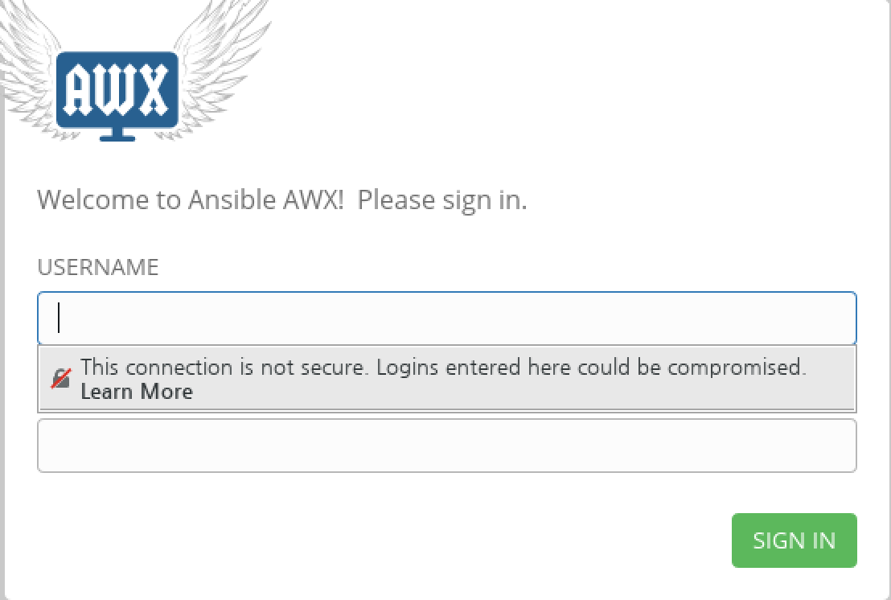
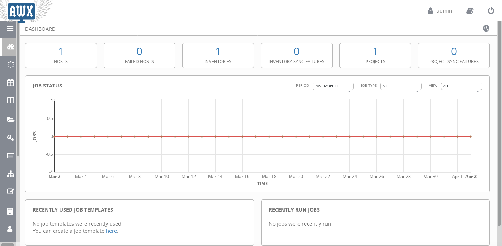
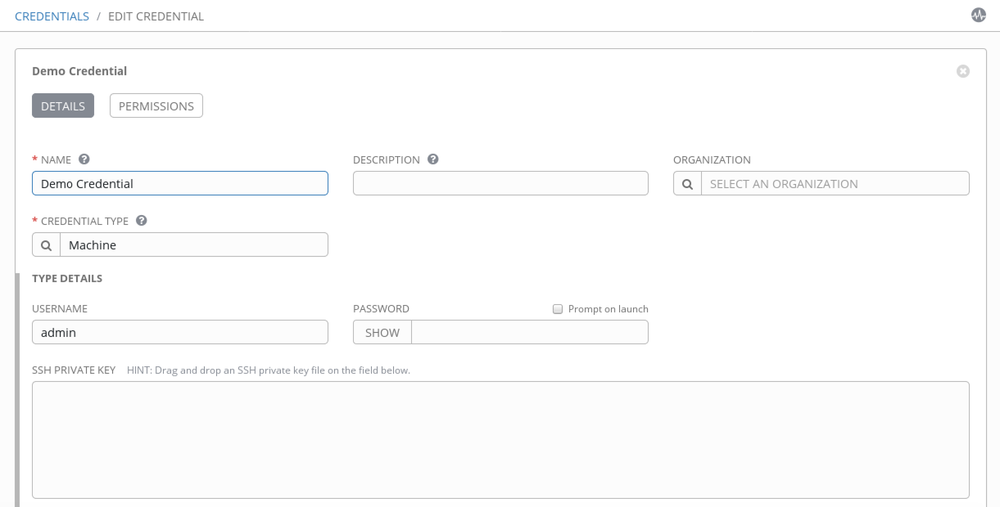

# AWX 설치 및 구성 방법
AWX는 Ansible Tower의 오픈소스 버전으로 ansible 플레이북 실행에 대한 권한 관리, ResAPI를 통한 연계, 셀프 서비스 포탈 등 다양한 관리 기능을 제공합니다.

## 사전 준비 사항
### 필요 패키지
  - Ansible Requires Version 2.4+
  - Docker
  - docker-py Python module
  - GNU Make
  - Git Requires Version 1.8.4+
  
```shell
yum -y install ansible docker python-docker-py make git
```

## 서비스 시작
### docker 서비스 시작
```shell
systemctl start docker
systemctl enable docker
```
## AWX 설치
git으로부터 awx의 최신 소스를 받아 설치하고, ansible-playbook 명령을 통해 기본 설치가 진행됩니다. 설치 관련 설정은 inventory 파일에서 진행되며, docker, openshift, kubernetes 를 구분하며 설정을 별개로 할 수 있으며, pgsql의 접속유저 및 포트 설정도 inventory에서 설정가능합니다.

```shell
git clone https://github.com/ansible/awx.git
cd awx/installer/
ansible-playbook -i inventory install.yml
```

설치로그 확인
```shell
docker images
docker ps
docker logs -f awx_task
```
## AWX 설정

### 접속정보
- 접속URL: http://[host_ip_address]
- 접속유저: admin
- 패스워드: password

### 메뉴 설명

awx에는 왼쪽에 다음과 같은 메뉴를 가지고 있으며, 이를 활용하여 설정을 진행합니다.
- DASHBOARD: awx 메인 화면으로 작업 실행 결과에 대한 전체 결과 출력
- JOBS: 종료되었거나, 진행중인 작업 템플릿의 리스트 및 상세 내용 출력
- SCHEDULES: 특정 시간 또는 주기적으로 반복해서 실행할 작업 템플릿을 등록
- PORTAL MODE: 모바일 환경에 적합한 UI 화면 
- CREDENTIALS: SSH, Windows, Cloud 등 다양한 접속 정보를 기록
- CREDENTIAL TYPES:
- INVENTORIES: 관래 대상 호스트들의 목록
- TEMPLATES: 플레이북을 등록하고 실제 작업이 이루어지도록 설정
- ORGANIZATIONS: 플레이북을 공통으로 사용할 단위
- USERS: aws 유저 등록 및 사용 권한 설정
- TEAMS: 동일한 권한을 사용할 유저들의 묶음 관리
- INVENTORY_SCRIPTS: 클라우드 환경에서 동적으로 관리할 호스트 목록을 가져오는 스크립트 관리
- NOTIFICATIONS: 작업 완료 및 실패 후 사용자에게 다양한 "알림"기능을 제공하는 기능 
- MANAGEMENT JOBS: 실행한 작업 목록에 대한 삭제, 저장된 Fact 정보 삭제 등 작업 관련 DB 관리  
- INSTANCE GROUPS: ansible tower 자체의 클러스터 관리, awx가 multi node cluster 구성될 수 있으며 이 때 사용되는 노드 관리
- SETTINGS: 플레이북 로컬 저장소 등 awx 세부 설정 가능

### 기본 설정 방법
awx를 사용하기 위해서는 아래와 같은 기본 설정이 필요합니다.

1. Project 등록

플레이북이 저장되는 공간을 지정하고 Project 이름을 등록합니다. 이 때 저장공간을 git을 추천합니다. 파일시스템 내부에 저장도 가능하나 awx container  가 재시작되면 플레이북들이 모두 사라질 것이기 때문에 외부 SCM에 플레이북을 저장해야 합니다.
참고로 파일시스템 저장 위치는 기본 */var/lib/awx/projects* 하위 디렉토리 입니다.

2. Credential 등록

Credential은 관리대상 서버들을 접속하기 위한 접속정보를 저장하는 곳입니다. ssh 및 windows 의 접속 정보는 *Credential Type*에서 *Machine*을 선택하고, 접속 유저명과 ssh key 또는 패스워드를 입력하면 됩니다.

3. Inventory 등록

관리대상 호스트들을 inventory에 등록합니다. 그리고 동일한 작업을 수행할 호스트들을 묶어 그룹으로 만들 수 있습니다. 또한 inventory 항목에서 *ansible adhoc* 명령 수행도 가능합니다.

4. Job Template 등록

플레이북을 등록하고 해당 플레이북을 접속할 *Credential*, 외부 변수 지정등을 지정하여 *Job Template* 을 생성합니다. 이렇게 *Job Template*이 생성되면 이를 실행하여 실제로 작업이 수행됩니다. 여기서 *Survey* 기능을 활용하면, Self-Service 포탈 형식으로 작업을 실행시킬 수 있습니다. 또한 *RestAPI*로 실행할 때도 해당 템플릿의 *Job Template ID*를 호출할 수 있습니다. *Job Template*을 실행하기 위해서는 실행하고자 하는 템플릿의 옆에 있는 *rocket*  아이콘을 누르면 됩니다. 


5. Job 상태 확인

작업이 실행되면 실시간으로 작업 상태가 웹 화면에 출력됩니다. 이 로그들은 *Job* 메뉴에서 언제든지 확인 가능하여, 현재 작동 중인 작업이나 기존에 수행되었던 작업 모두가 확인 가능합니다.

## 맺음말
지금까지 AWX를 설치하고 구성하는 방법에 대해 알아보았습니다. container 기반으로 설치되기 때문에 설치 자체는 어렵지 않으며, 설정 부분은 필요한 기능 부터 사용해보고 조금씩 사용법을 익혀가면 금방 익숙해지실 것이라 생각됩니다. "ansible-playbook 만 있으면 되지 무엇때문에 *AWX*가 필요하냐" 라고 물으실 수도 있겠지만, 작업 실행에 대한 권한 관리와 로그 관리 그리고 접속정보를 암호화해서 사용할 수 있다는 것만으로도 충분히 가치를 가진다고 생각합니다. 

자동화도구는 여러 서버들을 한번에 관리하도록 해주기 때문에 편리합니다. 대신 잘못된 사용으로 인한 여파도 커질 수 있기 때문에 *권한 관리*가 정말 중요합니다.
