# AWS API Gateway - HTTP API Practical Guide
- Date: 2020.10.23
- Yongki Kim(kyongki@)
- ChangeLogs
  - 2020.10.23: initial version

----

공식문서: https://docs.aws.amazon.com/apigateway/latest/developerguide/http-api.html
## AWS AWS Gateway - HTTP API
2020년 3월 12일 AWS API Gateway의 기능중 HTTP API 가 출시되었습니다. HTTP API는 낮은 지연시간(low latency)로 높은 성능으로 API Gateway를 구축할 수 있는데 특히 프록시 기능을 통해 유입되는 HTTP 요청을 다른 경로로 변경하거나, Lambda와 연동하여 serverless 환경을 구축하는데 매우 유용합니다. 또한 HTTP API는 기존 REST API에 비해 70% 정도 저렴한 가격으로 AWS API Gateway를 사용할 수 있게 합니다. 하지만 Rest API가 제공하는 모든 기능을 제공하지는 않습니다. 가령 캐싱이나 WAF와의 연동 같은 기능이 지원되지 않으며 좀 더 자세한 사항은 다음 비교 [링크](https://docs.aws.amazon.com/apigateway/latest/developerguide/http-api-vs-rest.html)를 참고하시기 바랍니다.
HTTP API를 사용하기 위해 당연히 [공식문서](https://docs.aws.amazon.com/apigateway/latest/developerguide/http-api.html)를 참고하는 것이 좋치만, 이를 보고 적용하다가 실제 구현하는데 어려움이 몇 가지 있었기에 이를 공유하고 문서를 작성하게 되었습니다.
## 기본 HTTP API 생성
### Q) HTTP API는 어떻게 만드나요? 해주세요!
API Gateway에서 HTTP API를 생성하기 위해서는 [AWS 웹콘솔](https://ap-northeast-2.console.aws.amazon.com/apigateway/main/apis?region=ap-northeast-2)에서 API Gateway를 선택합니다. 이후 *Create API*를 선택하고, *API name*을 기록한 후 계속 *다음*을 누르고 마지막에 *Create*을 선택합니다. 이 단계에서는 *integration*이나 *route*같은 별도 설정을 하지 않으셔도 됩니다.
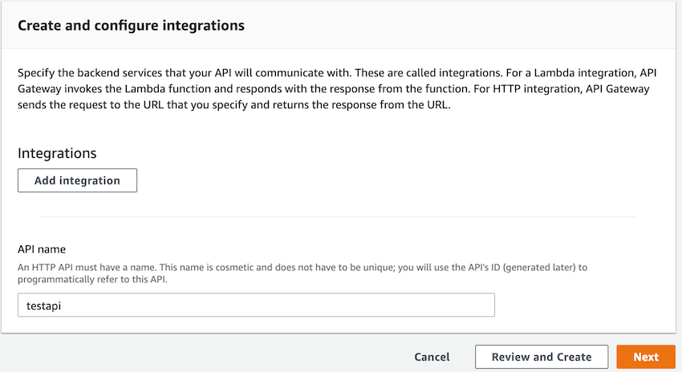

이 때, 방금 생성한 api를 외부에서 접속할 수 있는 경로가 만들어지는데 이는 stage에서 확인하실 수 있습니다.
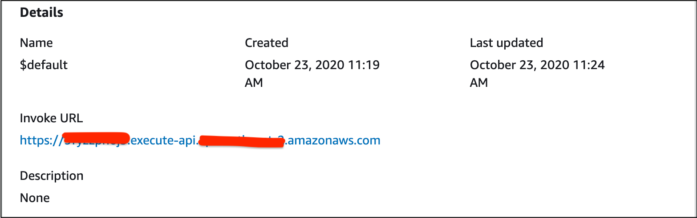

## 특정 URL로 전달(HTTP Integration)
### Q) *testapi*의 */book* 경로 들어오는 요청을 www.amazon.com/book2 로 전달하고 싶어요. 어서 해주세요!
특정 경로로 들어오는 요청을 다른 URL 경로로 전달하기 위해서는*/book* 경로를 위한 *Route*를 만들고, 외부로의 전달을 위한 *http integration*을 생성해야합니다. 이 때 타겟 경로는 public domain이어 합니다. 사설 도메인으로 연결하는 방법은 아래 *사설URL로 전달* 부분에서 설명드리겠습니다.

#### */book* Route 만들기
1. 왼쪽 메뉴에서 *Routes* 선택하고, *Create* 선택
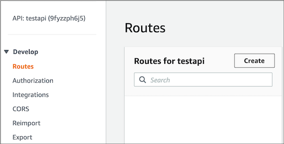

2. 경로 이름을 입력하고 *Create* 선택
경로를 생성할 때, 사용할 GET/POST/PUSH 등 Method를 선택할 수 있으며, 예제에서는 *ANY*를 사용했습니다.
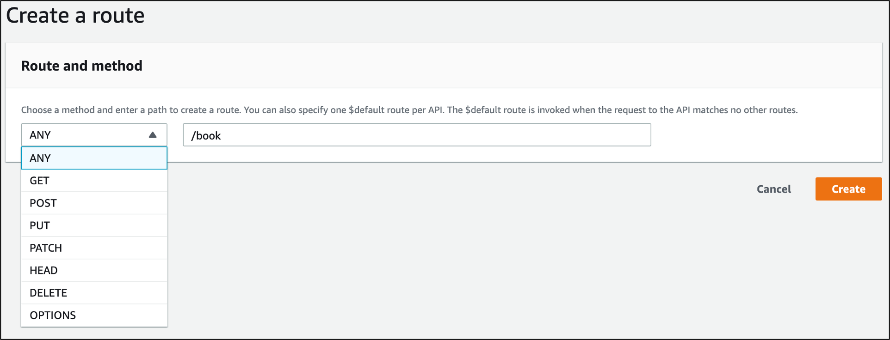

#### *www.amazon.com/book2* 연결하기
1. 생성한 */book* 경로에서 Method를 선택하면(여기서는 ANY), 다른 서비스와 연동할 수 있는 *Integration*을 연결 또는 생성할 수 있습니다.
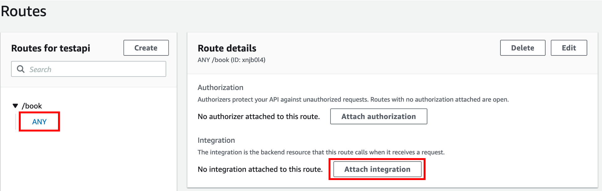

2. *Integration* 생성
- 화면에서 *Create and Attach an Integration* 선택
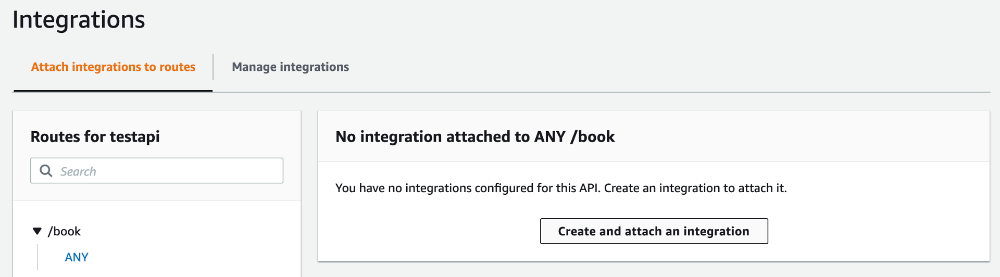

- 연동 대상으로 *HTTP URI* 선택
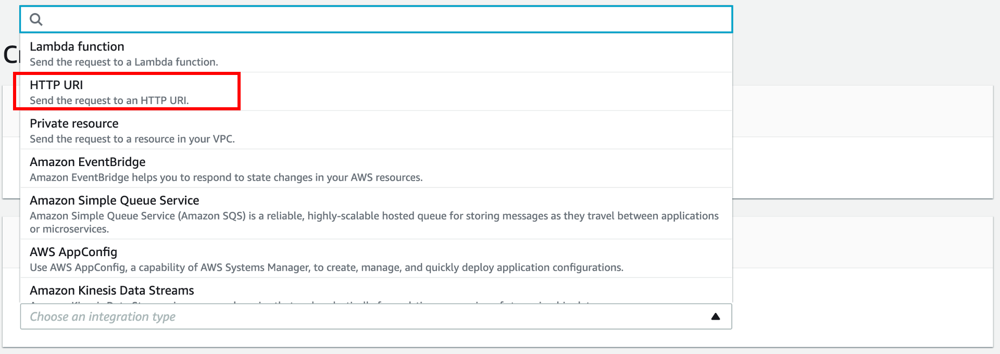

- 연동할 URI 경로를 적어주고 생성 확인
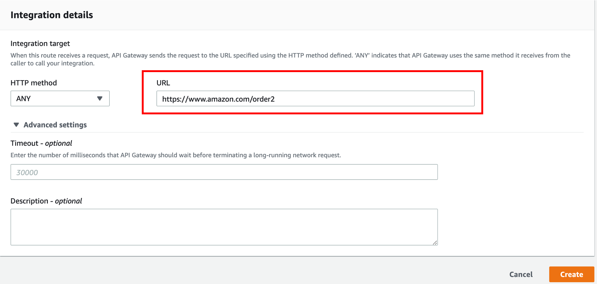

3. 연결 확인
*stage*에서 확인한 경로에 /book 경로를 붙인 후 www.amazon.com/order2로 전달되는지 확인.
물론 잘못된 경로이므로 강아지 또는 고양이가 보일 것입니다.

## 하위 URL 포함하여 전달(Magic Variable)
### Q) /book 하위 경로에 /book/order, /book/user 등 여러개의 경로가 있는데 여기는 접속이 안되네요. 고장인가요?
기본적으로 API GW는 지정된 경로만 접근할 수 있도록 설정됩니다. 요청하시는 것처럼 임의의 하위 경로를 접근하기 위해서는 Magic Variable을 사용해서 구현이 가능합니다. 이 때 중요한 점은 *Route*를 먼저 만들고 Integration을 만들어야 합니다. 아니면 안만들어집니다.
1. *Route*에서 *Create*을 누른 후, "/book/{proxy+}" 경로 입력하고 생성

2. 위와 동일하게 HTTP Integration을 생성하는데, 이 때 HTTP URI를 *https://www.amazon.com/{proxy}* 로 지정

3. 설정 완료 상태
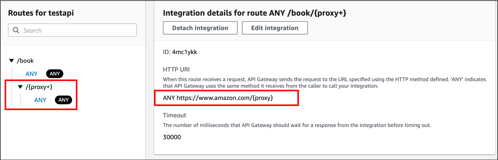

4. 연결 확인
웹브라우저에서 *https://ooo.execute-api.xxx.amazonaws.com/book/order* 와 같이 API 경로에서 /book 하위 경로가 에러없이 접속되는지 확인

## 라우팅 경로 가공
### Q) 마음이 바꼈어요. execute-api.aws.com/book/order 경로로 들어올 때, book만 빼서 www.amazon.com/order로 보내주세요. 금방 되죠?
이 경우도 마찬가지로 magic variable을 통해 새로운 http integration을 생성하여 구현이 가능합니다.
- Route: /book/{proxy+}
- URL: https://www.amazon.com/{proxy}

위와 같이 설정하면, 중간 경로를 뺄 수 있습니다.
## Default 경로 생성($default route)
### Q) 정의되지 않은 API 경로들은 모두 특정 에러페이지로 보내고 싶어요. 이건 진짜 쉽죠?
HTTP API는 $default 경로 생성하여 기본 경로를 지정할 수 있습니다. 알고 나면 쉽죠.
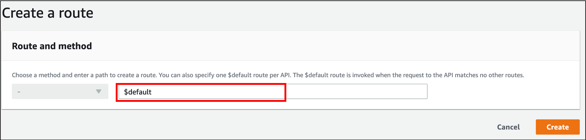

또한 유입되는 요청은 다음과 같은 우선순위로 경로를 결정하게 됩니다.
``` shell
For example, consider an API with a $default stage and the following example routes:

1. GET /pets/dog/1
2. GET /pets/dog/{id}
3. GET /pets/{proxy+}
4. ANY /{proxy+}
5. $default
```
참고: https://docs.aws.amazon.com/apigateway/latest/developerguide/http-api-develop-routes.html

## VPC 내부의 사설 URL과 연동(VPCLink + Private Resource)
### Q) api gateway의 /product 와 /marketing 경로로 들어오는 요청들은 VPC 내의 사설 ALB 와 연동시키고 싶어요. 해주세요.
api gateway는 사용자 VPC의 외부에 있기 때문에 VPC 내부의 자원과 통신하기 위해서는 VPCLink 생성과 Private Resource Integration이 필요합니다. 연동을 지원하는 내부 자원은 ALB, NLB, Cloud Map과 연동이 가능합니다. [참고링크](https://aws.amazon.com/about-aws/whats-new/2020/03/api-gateway-private-integrations-aws-elb-cloudmap-http-apis-release/)
1. VPC Link 생성
- 왼쪽 메뉴 상단에서 *VPC Links*를 선택하고 *VPC Link*를 생성합니다. VPC Link는 VPC당 하나만 만들면 되며, api마다 만들 필요는 없습니다.
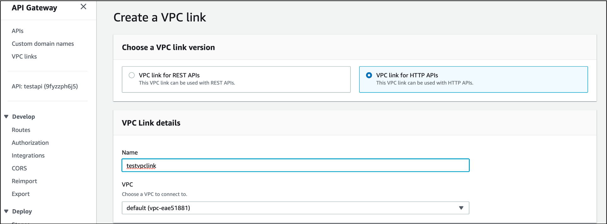

- 이 후, 서브넷과 보안그룹을 선택합니다. 참고로 서브넷과 보안그룹은 VPC Link가 한 번 만들어지면 수정이 불가능하므로, 수정을 위해서는 VPC Link를 지우고 새로 만들어야 합니다.

2. Private Resource Integration 생성
- *Route* 생성
  - Route: /product/{proxy+}
  - Route: /marketing/{proxy+}
- *Integration* 생성
  - Integration Type: Private Resource
  - Selection Method: Select Manually
  - Target Service: ALB/NLB
  - Load balancer: [your own ALB]
  - Listener: [your own listener]
  - VPC Link: testvpclink

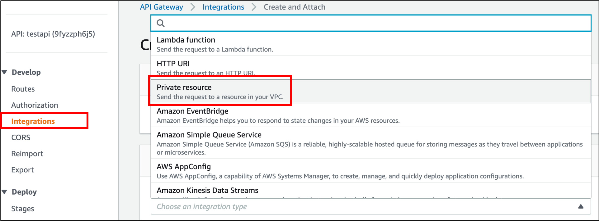

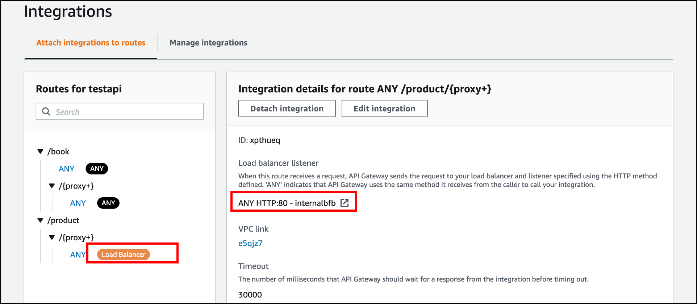

## API의 경로별 Throttling 제한
### Q) /user 로 들어오는 경로는 초당 1000명으로 제한하고 싶어요.
API Gateway에서 커넥션수 제한은 throttling으로 가능합니다. AWS Account당 10,000이 기본이며, route 당 설정도 가능합니다. route당 설정은 CLI 또는 SDK로 가능하며, 이 수는 account limit을 초과할 수 없습니다.

``` shell
aws apigatewayv2 update-stage \
    --api-id a1b2c3d4 \
    --stage-name dev \
    --route-settings '{"GET /pets":{"ThrottlingBurstLimit":100,"ThrottlingRateLimit":2000}}'
```

## CloudWatch Metric으로 모니터링
### Q) 모니터링은 어떻게 하면되나요? 비싼가요?
HTTP API의 상태를 모니터링하기 위해서는 Cloud Watch Metric을 이용할 수 있습니다. Metric은 15개월 동안 저장되어 있고, 6개의 메트릭(4xx, 5xx, Count, IntegrationLatency, Latency, DataProcessed)가 사용가능합니다. 사용 방법은 메뉴에서 *모니터링* 활성화만 하면 됩니다.
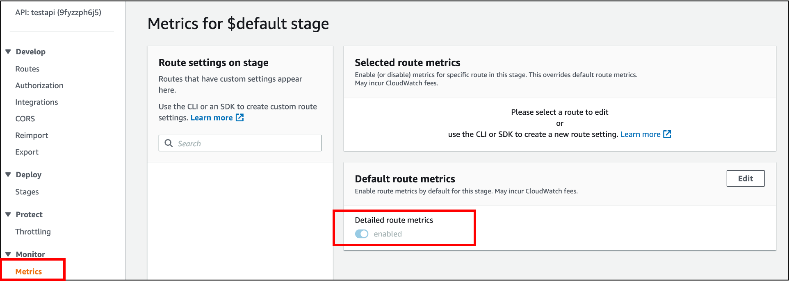

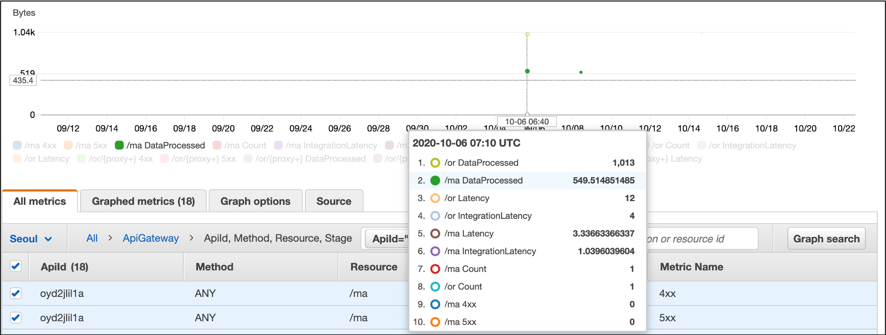

## Limit
- integration 대상과의 연결 timeout이 30초이며, hard limit.
- 전달 포트 제한(80,443,1024 이상만 허용), http integration으로 외부URI로 연결할 때 포트 확인 필요.
- VPC 내부에서 HTTP API로 연결(PrivateLink) 미지원. 현재(2020.10.23일) 개발 진행중.
- REST API는 NLB만 지원

## references
- GA: https://aws.amazon.com/blogs/compute/building-better-apis-http-apis-now-generally-available/
- Official Docs: https://docs.aws.amazon.com/apigateway/latest/developerguide/http-api.html
- Rest api vs Http api: https://docs.aws.amazon.com/apigateway/latest/developerguide/http-api-vs-rest.html
- HTTP API support ELB: https://aws.amazon.com/about-aws/whats-new/2020/03/api-gateway-private-integrations-aws-elb-cloudmap-http-apis-release/
