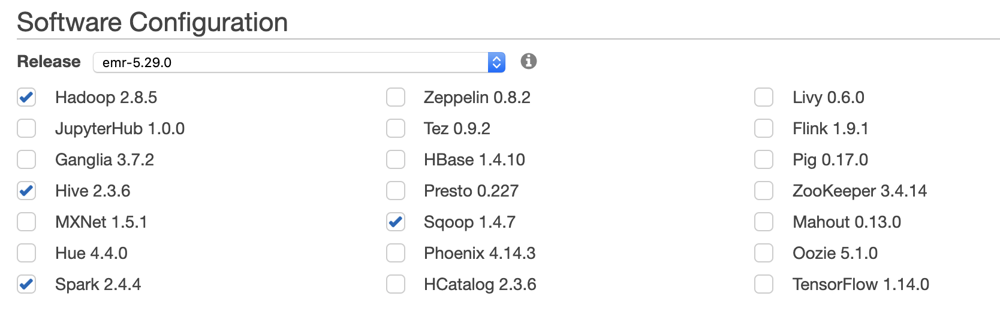

# ETL - AWS Dynamodb to S3 parquet
date: 2020.03.27
written by: Kim Yongki

## Creating Sample Table
1. Copy the following program and paste it into a file named [MoviesCreateTable.py](MoviesCreateTable.py).
2. To run the program, enter the following command.
``` shell
$ python3 MoviesCreateTable.py
```
### references
- ref: https://docs.aws.amazon.com/amazondynamodb/latest/developerguide/GettingStarted.Python.01.html

## Loading Sample Data
1. Download the sample data archive: [moviedata.zip](https://docs.aws.amazon.com/amazondynamodb/latest/developerguide/samples/moviedata.zip)
2. Extract the data file (moviedata.json) from the archive.
3. Copy the [moviedata.json](moviedata.json) file into your current directory.
4. Copy the following program and paste it into a file named [MoviesLoadData.py](MoviesLoadData.py).
5. To run the program, enter the following command.

``` shell
$ python3 MoviesLoadData.py
```

## Creating EMR Cluster
1. create emr in advanced mode
2. select emr-5.29.0 including *hadoop*, *Hive*, *Spark*, and *Sqoop*
* sqoop is needed for mysql ETL

3. select instance type, depending on your workload

## Connecting EMR
1. connect to emr via ssh

``` shell
ssh -i ~/key.pem hadoop@ec2-emr
```
2. git clone [emr-dynamodb-connector](https://github.com/awslabs/emr-dynamodb-connector)

``` shell
ec2-user$ sudo -i
root# su - hadoop
hadoop$ sudo yum -y install git
hadoop$ git clone https://github.com/awslabs/emr-dynamodb-connector.git
```

3. install maven

``` shell
sudo wget http://repos.fedorapeople.org/repos/dchen/apache-maven/epel-apache-maven.repo -O /etc/yum.repos.d/epel-apache-maven.repo
sudo sed -i s/\$releasever/6/g /etc/yum.repos.d/epel-apache-maven.repo
sudo yum install -y apache-maven
sudo yum remove java-1.7.0-openjdk.x86_64 -y
mvn --version
```

4. mvn install

``` shell
hadoop$ cd emr-dynamodb-connector
hadoop$ mvn clean install
```

5. hive sql
- file name: [load_ddb.sql](load_ddb.sql)
``` sql
drop table hive_movies;
CREATE EXTERNAL TABLE hive_movies (
    hive_year double,
    hive_title string,
    hive_info map<string,string>
)
STORED BY 'org.apache.hadoop.hive.dynamodb.DynamoDBStorageHandler'
TBLPROPERTIES (
    "dynamodb.table.name" = "Movies",
    "dynamodb.column.mapping" =
    "hive_year:year,hive_title:title,hive_info:info",
    "dynamodb.type.mapping" =
    "hive_year:N",
    "dynamodb.null.serialization" = "true"
);
```
- run the sql

``` shell
hive -f load_ddb.sql
```

- ref: [erm_export_guide](https://docs.aws.amazon.com/emr/latest/ReleaseGuide/EMR_Hive_Commands.html)
