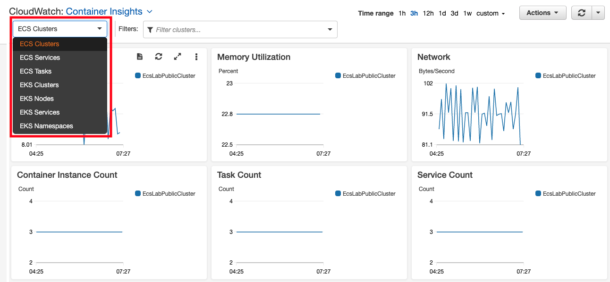
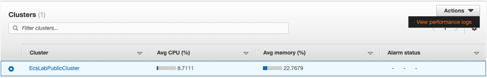
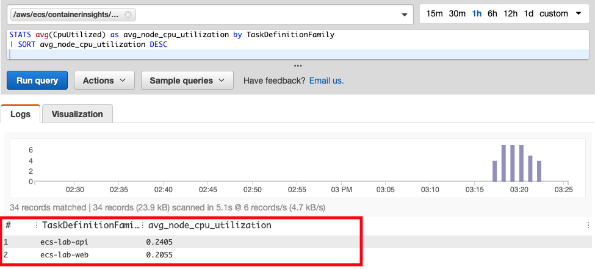
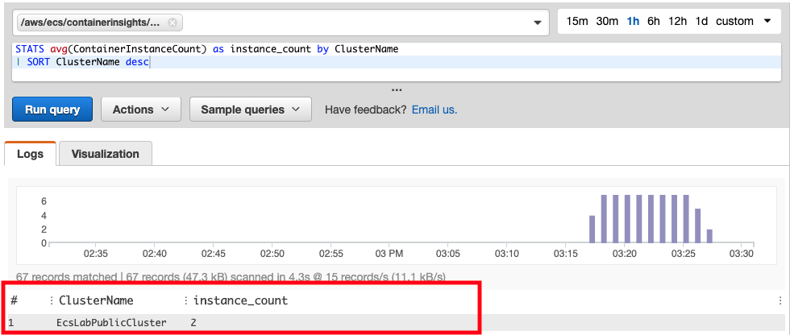
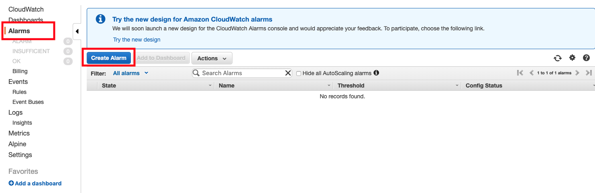
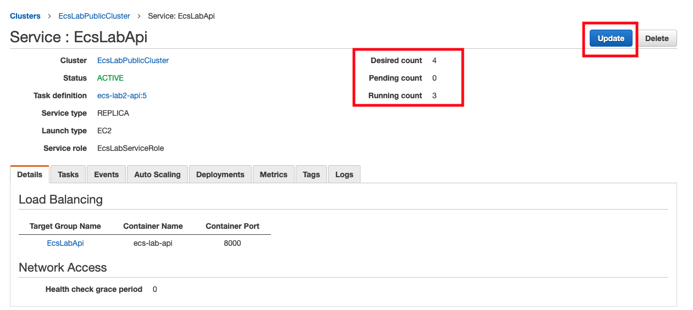
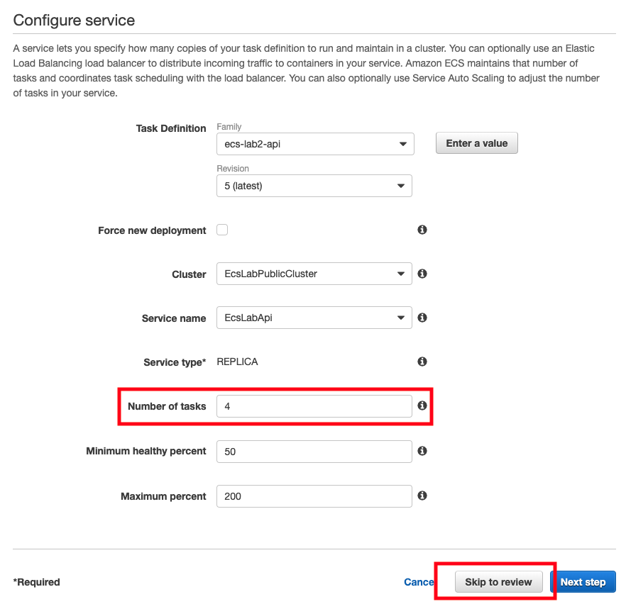
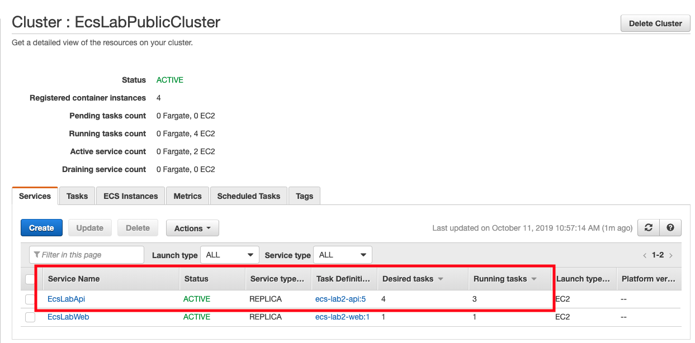
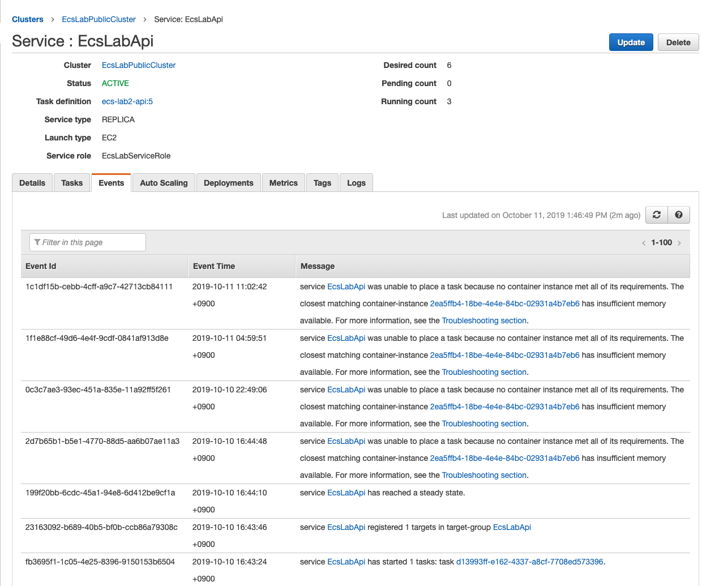
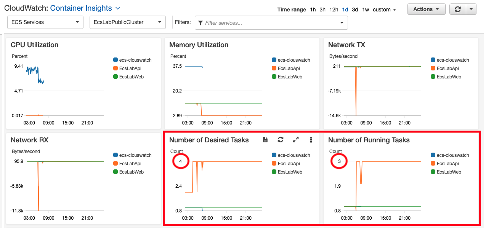

# ECS 환경에서 Container Insights를 활용한 컨테이너 모니터링 방법

Date: 10/11 2019, by Yongki, Kim(kyongki@)

이번 실습은 ECS환경에서 Container를 관리할 때 필요한 모니터링, 알람 설정 방법을 설명합니다. ECS 클러스터를 *CloudWatch*의 *Container Insights* 기능을 통해 모니터링할 수있도록 구성하여 각 Task의 CPU, 메모리, 네트워크 사용량 등을 확인할 수 있습니다. 또한 알람 구성과 Notification 구성을 통해 원하는 성능지표에 대해 실시간으로 알림을 받을 수 있도록 구성합니다. 이를 통해 서비스와 컨테이너(Task) 상태 그리고 이를 운영하는 EC2 인스턴스 상태를 효과적으로 모니터링할 수 있습니다.

**주요 실습 과정 내용**
* ECS 클러스터에 Container Insights 사용 방법
* Container Insights Metric(지표)을 통한 알람(Alarm) 및 알림(Notification) 설정
* ECS 콘솔 환경에서 서비스 Event 및 Log 확인
* ECS Task를 가동할 EC2 인스턴스 확장 방법

## 기존 Amazon ECS 클러스터에서 Container Insights 설정
기존 Amazon ECS 클러스터에서 Container Insights를 활성화하려면 다음 명령을 입력합니다. 아래 명령은 이전 실습에서 생성한 ecs-lab-workstation에서 실행합니다.

### 사전 작업
터미널에서 aws명령을 사용하기 위해서는 awscli 패키지 업데이트 및 자신의 AWS 자원을 접근하기 위한 인증 등록이 필요합니다.

#### awscli upgrade
aws 명령을 통해 Container Insight 모니터링을 활성화하기 위해서는 awscli를 업그레이드 해야 합니다. 이를 위한 명령어는 다음과 같습니다.

``` shell
$ sudo pip install --upgrade pip
$ sudo /usr/local/bin/pip install --upgrade awscli
```

#### aws credential 등록
aws ecs 명령이 정상적으로 작동하기 위해서는 *IAM* 에서 *Access Key* 와 *Secret Access Key* 를 생성하고, **aws configure** 명령을 통해 해당키를 등록해줘야 합니다.

``` shell
[ec2-user@ip-10-0-0-236 api]$ aws configure
AWS Access Key ID [None]: [자신의 access key 입력]
AWS Secret Access Key [None]: [자신의 secret access key 입력 ]
Default region name [None]: ap-northeast-2
```
 - 위 명령에서 *region name* 인 *ap-northeast-2* 는 서울 리전을 의미하며, 필요시 자신의 ECS 자원이 존재하는 리전으로 변경해야 합니다.

### ECS 클러스터 목록 확인
aws ecs list-clusters 명령을 통해 현재 클러스터 목록을 확인합니다.

``` shell
$ aws ecs list-clusters

{
    "clusterArns": [
        "arn:aws:ecs:ap-northeast-2:xxxxxxxxxxxx:cluster/default",
        "arn:aws:ecs:ap-northeast-2:xxxxxxxxxxxx:cluster/EcsLabPublicCluster"
    ]
}
```

### Container Insight 활성화
aws ecs update-cluster-settings 명령을 통해 container Insights 기능을 해당 클러스터에 활성화 합니다.
``` shell
$ aws ecs update-cluster-settings --cluster EcsLabPublicCluster --settings name=containerInsights,value=enabled
{
    "cluster": {
        "clusterArn": "arn:aws:ecs:ap-northeast-2:xxxxxxxxxxxx:cluster/EcsLabPublicCluster",
        "clusterName": "EcsLabPublicCluster",
        "status": "ACTIVE",
        "registeredContainerInstancesCount": 0,
        "runningTasksCount": 0,
        "pendingTasksCount": 0,
        "activeServicesCount": 0,
        "statistics": [],
        "tags": [],
        "settings": [
            {
                "name": "containerInsights",
                "value": "enabled"
            }
        ]
    }
}
```

### ECS 웹콘솔에서 Container Insights 활성화 확인
ECS 서비스 웹콘솔에 접속한 후, 왼쪽 메뉴에서 *Clusters* 메뉴선택하면, 클러스터 목록이 나타나고 해당 클러스터에 아래와 같이 *Container Insights* 가 활성화된 것을 확인할 수 있습니다.


## Container Insights 지표 보기
Container Insights를 설정하여 지표를 수집하고 난 후에는 CloudWatch 자동 대시보드에서 지표를 볼 수 있습니다.

### Container Insight 사용 방법
  1. https://console.aws.amazon.com/cloudwatch/ 에서 CloudWatch 콘솔을 엽니다.
  2. 화면 왼쪽 상단에서 개요 옆의 아래쪽 화살표를 선택하고 Container Insights를 선택합니다.
    클러스터에 대한 지표를 보여주는 그래프가 몇 개 나타납니다. 그래프 아래의 클러스터 목록에는 각 클러스터에 대해 상태 및 기본 지표가 표시됩니다. 특정 클러스터에 대해 보기를 필터링하려면 가운데 상단의 상자를 사용합니다.
    

  3. Clusters(클러스터)가 표시된 왼쪽 상단에서 모드를 바꿔가며 노드, Pod, 서비스, 작업 및 네임스페이스 수준의 지표를 확인합니다. 이때 개별 Pod 및 노드만 보도록 이러한 보기를 필터링할 수도 있습니다. 또한 Amazon EKS 지표와 Amazon ECS 지표 사이를 전환할 수 있습니다.
    
  4. 어떤 그래프에서든 범례 줄에서 멈춰 있으면 해당 리소스에 대한 자세한 정보를 확인할 수 있습니다.
  5. 대시보드에서 클러스터 중 하나에 관한 클러스터 수준의 로그를 보려면 화면 하단의 목록에서 해당 이름 옆에 있는 버튼을 선택합니다. 그런 다음 작업을 선택하고 목록에서 옵션 중 하나를 선택합니다. 새 브라우저가 나타나고 해당 리소스에 대한 CloudWatch Logs Insights 쿼리가 표시됩니다. 쿼리 실행을 선택합니다. 쿼리 결과가 표시됩니다. CloudWatch Logs Insights에 대한 자세한 내용은 CloudWatch Logs Insights로 로그 데이터 분석을 참조 하십시오.
    
  6. 노드, Pod 또는 작업 수준에서 페이지 하단의 목록에 현재 표시된 한 개 이상의 리소스에 관한 로그를 보려면 해당 리소스의 이름 옆에 있는 확인란을 선택합니다. 그런 다음 *Task* 를 선택하고 목록에서 옵션 중 하나를 선택합니다. 그러면 해당 리소스의 로그 또는 AWS X-Ray 추적을 볼 수 있습니다. 새 브라우저가 나타나고 요청한 정보가 표시됩니다.

## CloudWatch Logs Insights을 사용하여 Container Insights 데이터 보기
*Container Insights* 는 CloudWatch Logs에 저장된 성능 로그 이벤트를 사용하여 지표를 수집합니다. 컨테이너 데이터에 대한 추가 보기에서 *CloudWatch Logs Insights* 쿼리를 사용할 수 있습니다.
CloudWatch Logs Insights에 대한 자세한 내용은 *CloudWatch Logs Insights* 로 로그 데이터 분석을 참조하십시오.

### CloudWatch Logs Insights 사용 방법
  1. https://console.aws.amazon.com/cloudwatch/ 에서 *CloudWatch* 콘솔을 엽니다.
  2. 왼쪽 탐색 창에서 Insights를 선택합니다.
  화면 상단 근처에 쿼리 편집기가 있습니다. CloudWatch Logs Insights를 처음으로 열면 이 상자에는 최 신 로그 이벤트 20개를 반환하는 기본 쿼리가 포함되어 있습니다.
  3. 쿼리 편집기 위의 상자에서 쿼리할 Container Insights 로그 그룹을 선택합니다. 작업할 다음 예제 쿼리 에서는 로그 그룹 이름이 *performance* 로 끝나야 합니다.
    
  로그 그룹을 선택하면 CloudWatch Logs Insights가 로그 그룹 내 데이터에서 필드를 자동으로 검색하고 오른쪽 창에 있는 검색된 필드에 표시합니다. 또한 이 로그 그룹의 로그 이벤트를 시간의 흐름에 따라 보 여주는 막대 그래프도 표시합니다. 이 막대 그래프에서는 테이블에 표시된 이벤트뿐만 아니라 쿼리 및 시간 범위와 일치하는 로그 그룹 내 이벤트의 분포를 보여줍니다.

### 예제 쿼리
쿼리 편집기에서 기본 쿼리를 다음 쿼리로 바꾸고 **쿼리실행(Run query)**을 선택합니다.
  1. TaskFamily별 평균 CPU 사용량
  ```
  STATS avg(CpuUtilized) as avg_node_cpu_utilization by TaskDefinitionFamily
  | SORT avg_node_cpu_utilization DESC
  ```
  이 쿼리는 컨테이너 목록을 평균적인  CPU 이용률에 따라 정렬하여 보여줍니다.
      

  2. 클러스터당 EC2 사용 개수
  ```
  STATS avg(ContainerInstanceCount) as instance_count by ClusterName
  | SORT ClusterName desc
  ```
  이 쿼리는 클러스터당 사용되는 EC2 인스턴스의 개수를 보여줍니다.
      

  3. 서비스당 컨테이너 개수
  ```
  stats avg(RunningTaskCount) as container_count by ServiceName
  ```
  이 쿼리는 서비스당 가동되고 있는 컨테이너 개수를 보여줍니다.
      

## 장애 유발후, 모니터링 및 해결
실습을 위해 메모리 용량을 통한 장애를 일부러 유발시킨후, 이를 모니터링하는 방법과 alarm 구성하는 방법을 알아봅니다. 이 후 해당 장애를 해결하기 위한 조치를 진행합니다. 사전에 *Alarm* 및 *Notification* 구성을 완료하여, 이슈 발생시 자동으로 알람이 뜨도록 설정합니다.

### Alarm 및 Notification 구성 및 확인
원하는 이벤트에 대해서는 *Alarm* 또는 *Notification* 구성을 통해 개별적으로 수신을 받을 수 있습니다. *Alarm* 의 경우, *CloudWatch* 의 알람 영역에 표현되며, *Notification* 의 경우, 이메일을 통해 수신이 가능합니다. 이번 실습에서는 *EcsLabApi* 서비스의 *Pending Tasks* 지표를 통해 Task가 정상적으로 가동되지 않는 상황이 발생했을 때, *Alarm* 을 받도록 설정하겠습니다.

#### Alarm 및 Notification 설정 방법
1. *CloudWatch* 의 *Alarms* 메뉴 선택한 후, *Create Alarm* 선택
  
2. *Create new alarm* 메뉴에서 *Metric* 항목의 *Select metric* 선택 \
  
3. 지표 중에서 **ECS/ContainerInsights** 선택 후, **ClusterName,ServiceName** 선택 후, *EcsLabApi* 서비스의 **PendingTaskCount** 지표 선택 후, **Select Metric** 선택
  
4. 알람 생성값 입력
  4.1 *Alarm details* 항목 입력
    - *Name*: alarm_ecslabapi_pending
    - *Description*: alarm for ecslabapi pending tasks
  4.2 *Actions* 항목 입력
    - *Sending notification to*: *new list* 선택 후, topic name으로 *notification_list* 입력
    - *Email list*: [your email address]
    - *Create Alarm* 선택
  4.3 입력한 이메일 계정의 *확인 메일*에서 *confirm subscription* 선택
  4.4 웹콘솔에서 *View Alarm* 선택 후, 생성 완료
    

### 장애 유발
Task의 개수를 EC2가 수용할 수 있는 메모리 용량보다 크게 하며 원하는 만큼의 Task 개수(Desired Tasks)를 실행하지 못하도록 합니다. 이번 Lab에서는 *EcsLabApi* 서비스의 *desired tasks* 개수를 4개로 조절하여 가동시키고자 하는 task 개수를 증가시킬 것입니다. 해당 task는 *task definition*에서 정의한대로 각 task가 512MB 메모리를 점유하며, 현재 task가 가동되는 EC2는 1GB 메모리가 할당되어 있는 상태이므로, 가동시키고자 하는 task개수(desired task)만큼 task가 가동되지 못할 것입니다. 이 현상은 *desired tasks* 개수와 *running tasks* 개수의 차이를 통해 확인할 수 있습니다.

#### EcsLabApi 서비스의 Desired Tasks 개수 증가
1. Amazon ECS 서비스의 *Clusters* 메뉴에서 "EcsLabPublicCluster" 클러스터 선택
  
2. *Services* 메뉴에서 *EcsLabApi* 서비스 선택
  
3. 화면에서 현재 *Desired count* 와 *Running count*가 *1*로 표기되어 있는 확인
  
4. 화면 우측 상단의 *Update* 메뉴를 선택
5. *Number of tasks* 개수를 *4*로 입력한 후 *Skip to review* 선택
  
6. *Update Service* 를 선택하여 변경 적용
  
7. *Cluster:EcsLabPublicCluster* 화면에서 *Desired tasks* 개수와 *Running tasks* 개수 불일치 확인
  

### 모니터링을 통한 장애 확인
클러스터, 서비스, 또는 Task에서 변경 또는 에러가 발생했을 때, 이에 대한 로그는 *Service* 메뉴의 *Event* 또는 *Cloud Watch*의 *container insights* 메뉴에서 확인할 수 있습니다.

#### Event 항목을 통학 에러 확인
*Service* 또는 *Task*의 상태를 변경하였을 때, 이에 해당하는 로그는 *Service* 메뉴의 *Event*탭에서 확인할 수 있습니다. 이 메뉴에서는 변경 사항에 대해 이벤트가 발생한 시간과 관련 메시지를 보여줍니다. 또한 이전 설정한 **ALARM** 과 **이메일알림** 을 통해서도 이슈를 확인할 수 있습니다.
  

#### Container Insights 대시보드를 통한 개수 불일치 확인
*Container Insights*는 *Desired Tasks*와 *Running Tasks*의 대시보드를 기본 제공합니다. 두 지표를 확인함으로써 원하는 만큼의 *Task*가 정상적으로 가동중인지 확인할 수 있습니다.
1. Cloud Watch 의 Container Insights 선택
    
2. *Desired Tasks*와 *Running Tasks*의 대시보드 확인
  - 대시보드 화면의 로그데이터를 받아오는 시간때문에 화면에 표시되는데 수분이 소요될 수 있습니다.
    


### 장애 해결
실습에서 발생시킨 이슈는 Task에서 필요로하는 메모리가 EC2가 보유하고 있는 메모리보다 많기 때문에 발생하는 것이므로 Task를 가동할 EC2 인스턴스의 개수를 증가시킴으로써 해결할 수 있습니다. ECS환경에서는 *Scale ECS Instances* 기능을 통해 필요시 클러스터 운영에 필요로하는 EC2 인스턴스를 손쉽게 추가할 수 있습니다.
1. 탐색 창에서 클러스터를 선택하고 조정할 클러스터를 선택
2. *Cluster*에서 *ECS Instances* 선택후, *Scale ECS Instances* 확인
  
3. Desired number of instances(원하는 인스턴스 개수)의 경우 클러스터를 조정할 인스턴스 개수를 입력하고 Scale(확장)을 선택합니다.
* 참고: *Scale ECS Instances* 메뉴가 없을 경우, *auto scaling group* 메뉴를 통해 인스턴스 확장이 가능합니다. 해당 인스턴스는 *CloudFormation* 템플릿에 의해 자동으로 설정되어 생성되기 때문에 *Desired Capacity* 와 *Max* 만 원하는 값으로 수정하고 저장하면 자동으로 인스턴스가 생성됩니다.

## 결론
이번 실습을 통해 ECS의 서비스 및 Task를 모니터링할 수 있는 Container Insights에 대해 알아보았습니다. Container Insights는 CloudWatch에서 제공하는 컨테이너 모니터링 도구이기 때문에 하나의 모니터링 도구에서 기존 EC2 환경뿐 아니라 컨테이너까지 성능지표를 확인할 수 있게 합니다. 또한 CPU, 메모리, 네트워크 사용량, 스토리지 사용량, 컨테이너 사용 개수 등 다양한 지표를 기본으로 제공하기 때문에 편리하게 컨테이너 상태를 알아볼 수 있습니다.
