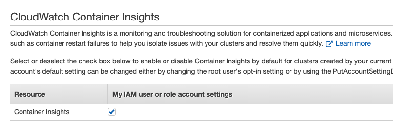
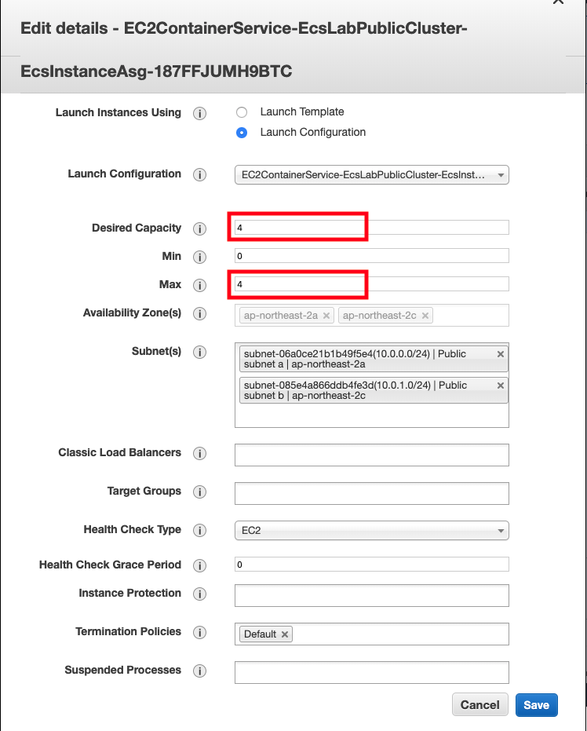

# Monitoring a Container with Container Insights on AWS ECS Environment

Date: 10/11 2019, by Yongki, Kim(kyongki@)

- Korean: https://github.com/hatsari/article/blob/master/container_insights/container_insights.md
- English: https://github.com/hatsari/article/blob/master/container_insights/container_insights_en.md

This lab explains how to monitor container status on ECS using *Container Insights* of CloudWatch. Container Insights shows each Task's CPU, memory, network usage etc, as well combining with *alarm* and *notification* of *CloudWatch*, user can receive an alarm or email in real time.

**Key Practices**
* Setting Container Insights on specific ECS Cluster
* Configuring Alarm and Notification for Container Insights Metric
* Viewing Event and Log on ECS console
* Expanding EC2 instance which running Tasks automatically

## *Container Insights* Configuration on AWS ECS Cluster
An User can activate *Container Insights* with **aws** command. This command should be typed on *ecs-lab-workstation* launched earlier lab.

### Before Activation
In order to use **aws** command on terminal, an user should upgrade *awscli* package and register user authentication to access AWS resources.

#### *awscli* upgrade
To enable monitoring through *Container Insights*, *awscli* package should be upgraded to version 1.16.200 or later. Below is the command to upgrade *awscli* using *pip*.

``` shell
$ sudo pip install --upgrade pip
$ sudo /usr/local/bin/pip install --upgrade awscli
```

#### Registering aws credential
In order for *aws ecs* command to work properly, an user should create *Access Key ID* and *Secret Access Key* on *IAM* console and register those keys on terminal.

``` shell
[ec2-user@ip-10-0-0-236 api]$ aws configure
AWS Access Key ID [None]: [your own access key]
AWS Secret Access Key [None]: [your own secret access key]
Default region name [None]: ap-northeast-2
```
 - *ap-northeast-2* means Seoul region, you have to change the region name to where your resources, especially ECS, exist.
 - **CAVEAT**: After finishing the lab, you mush delete those secret information. It will be saved on *~/.aws/credentials* file

### CloudWatch Container Insights activation
On left pane of ECS console, select **Account Settings** menu. Next, check the **My IAM User or role account settings** to enable or disable Container Insights by default for clusters created by your current IAM user or role.
                                                                                                                                                                              


### ECS Cluster list
Using **aws ecs list-clusters** command, user can confirm his own cluster list.

``` shell
$ aws ecs list-clusters

{
    "clusterArns": [
        "arn:aws:ecs:ap-northeast-2:xxxxxxxxxxxx:cluster/default",
        "arn:aws:ecs:ap-northeast-2:xxxxxxxxxxxx:cluster/EcsLabPublicCluster"
    ]
}
```

### Enabling Container Insights
Using **aws ecs update-cluster-setting** command, user can enable *Container Insights* function.

``` shell
$ aws ecs update-cluster-settings --cluster EcsLabPublicCluster --settings name=containerInsights,value=enabled
{
    "cluster": {
        "clusterArn": "arn:aws:ecs:ap-northeast-2:xxxxxxxxxxxx:cluster/EcsLabPublicCluster",
        "clusterName": "EcsLabPublicCluster",
        "status": "ACTIVE",
        "registeredContainerInstancesCount": 0,
        "runningTasksCount": 0,
        "pendingTasksCount": 0,
        "activeServicesCount": 0,
        "statistics": [],
        "tags": [],
        "settings": [
            {
                "name": "containerInsights",
                "value": "enabled"
            }
        ]
    }
}
```

### Verifying Container Insights feature enabled on ECS Web console
After accessing ECS web console, and select **Clusters** menu on left pane, then user will see the message, **CloudWatch monitoring container insights**, like below screenshot.


## Looking inside *Container Insights*
User can see *CloudWatch* dashboard after configuring the metric of *Container Insights*.

### Container Insight 사용 방법
- quoted from here: https://docs.aws.amazon.com/AmazonCloudWatch/latest/monitoring/ContainerInsights.html, adding screenshots.

  1. Open the CloudWatch console at https://console.aws.amazon.com/cloudwatch/
  2. In the upper left of the screen, select the down arrow next to **Overview** and choose **Container Insights**
    Several graphs appear, displaying metrics about your clusters. Below the graphs is a list of clusters, with health and basic metrics shown for each one.
    To filter the view to a certain cluster, use the box at the top in the middle.
    

  3. At the top left, where it shows Clusters, switch to see metrics at the node, pod, service, task, and namespace levels. When you do so, you can also filter those views to look only at individual pods and nodes. You can also switch between Amazon EKS and Amazon ECS metrics.
    

  4. In any graph, pause on a legend line to see more information about that resource.
  5. At the cluster level, to view logs about one of the clusters in the dashboard, select the button next to its name in the list at the bottom of the screen. Then choose **Actions** and select one of the options in the list.
    - A new browser appears, showing a CloudWatch Logs Insights query for that resource.
    - Choose **Run query**. The query results are displayed.
    

  6. At the node, pod, or task level, to view logs about one or more resources currently displayed in the list at the bottom of the page, select the check boxes next to the names of those resources. Then choose Actions and select one of the options in the list. You can view logs or AWS X-Ray traces of the resource.

## Using CloudWatch Logs Insights to View Container Insights Data
Container Insights collects metrics by using performance log events, which are stored in CloudWatch Logs. You can use CloudWatch Logs Insights queries for additional views of your container data.

For more information about CloudWatch Logs Insights, see Analyze Log Data with CloudWatch Logs Insights. For more information about the log fields you can use in queries, see .

### To use CloudWatch Logs Insights to query your container metric data
  1. Open the CloudWatch console at https://console.aws.amazon.com/cloudwatch/
  2. In the navigation pane, choose **Insights**
    - Near the top of the screen is the query editor. When you first open CloudWatch Logs Insights, this box contains a default query that returns the 20 most recent log events
  3. In the box above the query editor, select one of the Container Insights log groups to query. For the following example queries to work, the log group name must end with **performance**
    
  When you select a log group, CloudWatch Logs Insights automatically detects fields in the data in the log group and displays them in **Discovered fields** in the right pane. It also displays a bar graph of log events in this log group over time. This bar graph shows the distribution of events in the log group that matches your query and time range, not only the events displayed in the table.

### Query Examples
In query editor, replace the default query to below one, and press **Run query**

  1. CPU Average Usage per TaskFamily
  ```
  STATS avg(CpuUtilized) as avg_node_cpu_utilization by TaskDefinitionFamily
  | SORT avg_node_cpu_utilization DESC
  ```
  Below is the result of example query. The result show container's CPU average usage per TaskFamily
      

  2. Used EC2 per Cluster
  ```
  STATS avg(ContainerInstanceCount) as instance_count by ClusterName
  | SORT ClusterName desc
  ```
  Below is the result of example query. The result shows how many ec2 are running for container.
      

  3. Container Count per Service
  ```
  stats avg(RunningTaskCount) as container_count by ServiceName
  ```
  Below is the result of example query. The result shows how many containers are running on service
      

## Troubleshooting Scenario
For the lab scenario, you will create container(Task) creation issue deliberately, monitor the status, and check the alarm and notification. After that, you will resolve the problem. As an early step, you have to configure *alarm* and *notification* on CloudWatch, it will help you identify the issue promptly.

### Configuring Alarm and Notification on CloudWatch
*Alarm* and *Notification* send user an event which user wants to receive individually. *Alarm* is shown in CloudWatch's alarm area, and *Notification* can sends a message using email or other methods. In this lab, you will set up alarm and notification to receive a message when running Tasks can't increase to the desired Tasks through *Pending Tasks* metric of *EcsLabApi* service.

#### How to configure it
1. Press *Alarms* menu on CloudWatch, and Select *Create Alarm*
  
2. Choose *Select metric* of *Metric* item on *Create new alarm* menu \
  
3. Select **ECS/ContainerInsights** among the metrics, next select **ClusterName,ServiceName**, and check **PendingTaskCount** metric of *EcsLabApi* service, then press **Select Metric**
  
4. Input alarm parameters

  4.1 Input parameters of *Alarm details*
    - *Name*: alarm_ecslabapi_pending
    - *Description*: alarm for ecslabapi pending tasks

  4.2 Input parameters of *Actions*
    - *Sending notification to*: press *new list* , input *notification_list* as topic name
    - *Email list*: [your email address]
    - press *Create Alarm*

  4.3 check your mailbox of mail address you wrote at previous step
      - press *confirm subscription* link in your confirmation mail

  4.4 Press *View Alarm* on CloudWatch web console, then creation completed
    

## Making Trouble
Increase the Task counts more than EC2's memory capacity, then Tasks will fail to reach up to *desired Tasks*. In this lab, *desired tasks* value of *EcsLabApi* service will be adjusted to 4, then running tasks will increase automatically. Each Task is consuming 512MB memory as defined in *task definition* however, *running tasks* may not increase to 4 because EC2's memory capacity is total 1GB. User can identify the gap between *desired tasks* and *running tasks*.

#### Increase *desired tasks* of *EcsLabApi*
1. Select *EcsLabPublicCluster* Cluster on *Clusters* menu on Amazon ECS web console
  
2. Select *EcsLabApi* service on *Services* menu
  
3. Confirm that the value of *desired tasks* and *running tasks* is **1**
  
4. Press *Update* menu on upper left side of screen
5. Input **4** in *Number of tasks* field, and press *Skip to review*
  
6. Apply changes pressing *Update Service*
  
7. Confirm the difference of *Desired tasks* and *Running tasks* on *Cluster:EcsLabPublicCluster* screen
  

### Identifying Trouble Watching Monitoring Page
When some errors or changes occur in Cluster, Service, or Tasks, those log appears on *Event* of *Service* or *container insights* menu of *CloudWatch*.

#### Confirming Error on Event Tab
There is a *Event* Tab on *Service* menu, user can identify logs here. This log shows event time and relevant messages, as well user can check the event using *alarm* and *email notification* which you set up already.
  

#### Confirming the difference on Container Insights dashboard
*Container Insights* provides *Desired Tasks* and *Running Tasks* out of box. Checking those two metrics, user can know *Task*'s running status.
1. Press *Container Insights* of *CloudWatch*
    
2. Check the *Desired Tasks* and *Running Tasks* on dashboard
    

### Resolving The Issue
The issue caused by memory capacity can be resolved by increasing the count of EC2 instance. User can adjust it easily with *Scale ECS Instances* feature.
1. Select *Cluster* which you want to change
2. *Cluster* -> *ECS Instances* tab, then press *Scale ECS Instances* menu
  
3. Input the value **2** in *Desired number of instances* field, and press **Scale**
4. check the EC2 instances on EC2 console
* If you can't find *Scale ECS Instances* menu, then use *auto scaling group* menu on *ECS Instances* tab. Instances running container will be increased automatically by CloudFormation template, so just adjusting the value of *Desired Capacity* and *Max* fields will create instances.

#### Instance Auto scale                                                                                                                                                      
1. Select **Auto Scaling** in **Add additional ECS Instances using Auto Scaling or Amazon EC2** sentence, then new EC2 console will appear. Next, select **Action** >> **Edit* menu to adjust the count of instances.
                                                                                                    

2. Change the value of **Desired Capacity** and **Max** in menu.
  

## Conclusion
Container Insights is useful tool to identify or monitor the status of ECS Cluster, Service, and Tasks. Also User can check the various container metrics, even EC2 instances within CloudWatch. Through this lab's guide, you already accomplished ECS monitoring ability as like CPU, memory, network usage, storage usage, and consuming container count etc.
